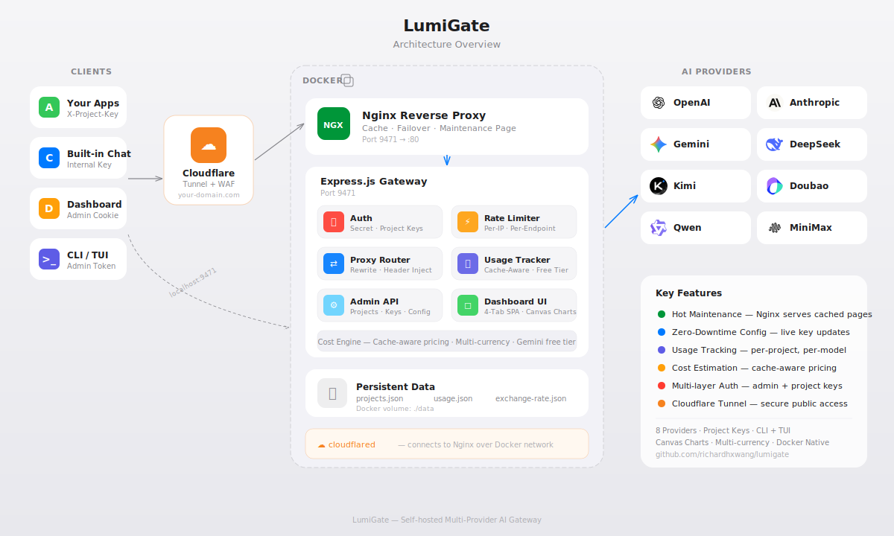

# AI API Gateway

A self-hosted, multi-provider AI API gateway with usage tracking, cost estimation, and a built-in dashboard.

Nginx + Express.js. All your AI providers behind a single endpoint with hot maintenance.

## Architecture

<p align="center">
  
</p>

## Features

- **Multi-Provider Proxy** — Single `/v1/{provider}/` endpoint routes to OpenAI, Anthropic, Gemini, DeepSeek, Kimi, Doubao, Qwen, MiniMax
- **Hot Maintenance** — Nginx reverse proxy serves cached pages & maintenance responses during app restarts
- **Project Key Auth** — Unique `X-Project-Key` per project, CRUD via dashboard
- **Usage Tracking** — Per-project, per-model request/token counts with cache hit/miss breakdown
- **Cost Estimation** — Cache-aware pricing (input/cached-input/output), Gemini free tier support, USD/CNY toggle with auto exchange rate
- **Dashboard** — 4-tab SPA with Canvas charts, mobile responsive, Apple HIG style
- **Built-in Chat** — SSE streaming chat interface supporting all providers
- **CLI & TUI** — Terminal tools (`cli.sh` for quick commands, `tui.js` for full-screen interface)
- **Security** — Admin auth (cookie + token), rate limiting, CORS restriction, input sanitization, graceful shutdown
- **Docker-Native** — Nginx + Express + Cloudflare Tunnel, healthcheck, volume-persisted data
- **Zero-Downtime Config** — Change API keys, add providers via dashboard without restart

## Quick Start

### 1. Clone and configure

```bash
git clone https://github.com/richardhxwang/ai-api-gateway.git
cd ai-api-gateway
cp .env.example .env
# Edit .env with your API keys
```

### 2. Create `.env`

```env
# At least one provider key required
DEEPSEEK_API_KEY=sk-xxx
OPENAI_API_KEY=sk-xxx
# ANTHROPIC_API_KEY=sk-ant-xxx
GEMINI_API_KEY=AIzaSyxxx
# KIMI_API_KEY=sk-xxx
# DOUBAO_API_KEY=xxx
# QWEN_API_KEY=sk-xxx
# MINIMAX_API_KEY=xxx

# Server
PORT=9471
ADMIN_SECRET=your-admin-password

# Cloudflare Tunnel (optional)
# CF_TUNNEL_TOKEN_AIGATEWAY=xxx
```

### 3. Run

```bash
# With Docker (recommended)
docker compose up -d --build

# Or directly
npm install
node server.js
```

Dashboard: `http://localhost:9471`
Chat: `http://localhost:9471/chat`

## API Reference

### Proxy Endpoints

All AI provider APIs are accessible via:

```
POST /v1/{provider}/v1/chat/completions
```

**Providers:** `openai`, `anthropic`, `gemini`, `deepseek`, `kimi`, `doubao`, `qwen`, `minimax`

**Authentication:** Include `X-Project-Key` header or `Authorization: Bearer {project-key}`

```bash
curl -X POST https://your-gateway.com/v1/openai/v1/chat/completions \
  -H "Content-Type: application/json" \
  -H "X-Project-Key: pk_your_project_key" \
  -d '{
    "model": "gpt-4.1-nano",
    "messages": [{"role": "user", "content": "Hello"}]
  }'
```

### Public Endpoints

| Method | Path | Description |
|--------|------|-------------|
| GET | `/health` | Health check (used by Docker) |
| GET | `/providers` | List all providers and status |
| GET | `/models/{provider}` | List models for a provider |

### Admin Endpoints (require auth)

| Method | Path | Description |
|--------|------|-------------|
| POST | `/admin/login` | Login with `{ secret }`, sets cookie |
| GET | `/admin/auth` | Check auth status |
| GET | `/admin/uptime` | Server uptime |
| GET | `/admin/test/{provider}` | Test provider connection |
| GET | `/admin/projects` | List projects |
| POST | `/admin/projects` | Create project `{ name }` |
| PUT | `/admin/projects/{name}` | Update project |
| DELETE | `/admin/projects/{name}` | Delete project |
| POST | `/admin/projects/{name}/regenerate` | Regenerate key |
| GET | `/admin/usage?days=7` | Detailed usage data |
| GET | `/admin/usage/summary?days=7` | Aggregated usage summary |
| GET | `/admin/rate` | Current USD/CNY exchange rate |
| POST | `/admin/key` | Update provider API key at runtime |

## Adding a New Provider

If the provider uses an OpenAI-compatible API format, add it in `server.js`:

1. Add to `PROVIDERS`:
```javascript
newprovider: {
  baseUrl: process.env.NEWPROVIDER_BASE_URL || "https://api.newprovider.com",
  apiKey: process.env.NEWPROVIDER_API_KEY,
},
```

2. Add models to `MODELS`:
```javascript
newprovider: [
  { id: "model-name", tier: "standard", price: { in: 1.0, cacheIn: 0.25, out: 2.0 }, caps: ["text"], desc: "Description" },
],
```

3. If the API format differs (like Anthropic), add special handling in the proxy's `pathRewrite` and auth injection sections.

## Security

| Layer | Protection |
|-------|-----------|
| **Cloudflare Access** | Google OAuth for dashboard, bypass for `/v1/*` API paths |
| **Admin Auth** | Cookie + `X-Admin-Token` header, bcrypt-equivalent secret |
| **Project Keys** | 48-char random hex per project, enable/disable/regenerate |
| **Rate Limiting** | 120 req/min proxy, 60 req/min admin, 10/15min login |
| **CORS** | Same-origin only |
| **Input Sanitization** | Project names validated, .env writes sanitized against injection |
| **XSS Prevention** | HTML-escaped user data in dashboard |
| **Graceful Shutdown** | Connection draining, data flush on SIGTERM |
| **Docker Healthcheck** | HTTP `/health` every 30s |

## Project Structure

```
├── server.js            # Express server — proxy, auth, usage tracking, admin API
├── nginx/
│   └── nginx.conf       # Reverse proxy — cache, failover, maintenance pages
├── public/
│   ├── index.html       # Dashboard — 4-tab SPA with Canvas charts
│   ├── chat.html        # Built-in chat interface with SSE streaming
│   ├── architecture.svg # Architecture diagram
│   ├── favicon.svg      # Site icon
│   └── logos/           # Provider logo assets (128×128 PNG)
├── cli.sh               # CLI tool — status, providers, test, usage
├── tui.js               # TUI tool — full-screen terminal dashboard
├── data/                # Persistent state (Docker volume)
│   ├── projects.json    # Project keys
│   ├── usage.json       # Usage & token counts
│   └── exchange-rate.json
├── Dockerfile
├── docker-compose.yml   # Nginx + Express + Cloudflare Tunnel
├── .env                 # API keys & config (git-ignored)
└── .gitignore
```

## License

MIT
